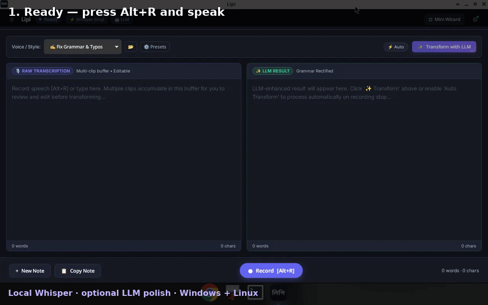

<p align="center">
  
</p>

# Lipi (লিপি)

**Lipi** (Bengali for *"script"* or *"writing"*) is a fast, lightweight, local-first voice dictation app and AI writing assistant for the desktop.

Press **`Alt + R`** in any app, speak, and press it again. Lipi transcribes your voice, optionally polishes it with an LLM, and pastes the result straight into the window you were working in: your editor, browser, terminal, or chat app.

<p align="center">
  
</p>

<p align="center">
  <a href="https://github.com/debjit/lipi/releases"><b>Download</b></a> ·
  <a href="#features">Features</a> ·
  <a href="#quick-start">Quick start</a> ·
  <a href="#configuration">Configuration</a> ·
  <a href="#faq">FAQ</a> ·
  <a href="#building-from-source">Build from source</a>
</p>

---

## Features

- **Dictate anywhere with `Alt + R`.** Lipi records from any app, then brings your original window back and pastes the text for you.
- **Offline or cloud transcription.** Run Whisper models locally on your CPU or GPU with no internet connection, or use fast cloud APIs such as Groq, Cloudflare Workers AI, or OpenAI.
- **Live dictation (optional, local only).** Text appears each time you pause while the microphone stays open.
- **AI polish.** Automatically fix grammar, change tone, summarize, or turn speech into bullet points with a local or remote LLM. Prompts are plain Markdown files you can edit.
- **Mini floating widget with `Alt + M`.** Shrink Lipi into a small always-on-top pill that stays out of your way.
- **Private, local history.** Every note and transcript is stored on your machine in SQLite and can be searched later.

## Download

Pre-release builds are available on the **[GitHub Releases](https://github.com/debjit/lipi/releases)** page.

| Platform | Formats |
| :--- | :--- |
| Windows | `.msi`, `setup.exe` (NSIS) |
| Linux (x86_64) | `.deb`, `.AppImage` |

## Quick start

1. Install and open Lipi. The setup wizard checks your RAM and CPU and recommends either local or cloud transcription.
2. Pick a speech engine:
   - **Local:** choose a runner and a model (start with `base` or `small`), and Lipi downloads it for you.
   - **Cloud:** choose a provider and paste your API key.
3. Optional: in **Settings > Preferences**, turn on **Paste into previous application**.
4. Switch to any app, press **`Alt + R`**, speak, then press **`Alt + R`** again to stop.

The transcript (polished by your active AI preset, if auto-transform is on) is pasted into that app.

> [!NOTE]
> If you press `Alt + R` while Lipi's own window is focused, the text stays in Lipi's editor and Lipi does not switch to another window.

### Keyboard shortcuts

| Shortcut | Action |
| :--- | :--- |
| `Alt + R` | Start or stop recording from anywhere |
| `Alt + M` | Switch between the full window and the mini floating widget |

## Configuration

All settings live in the **Settings** page, which has four tabs.

### Speech recognition (ASR)

- **Engine**
  - **Remote API:** presets for Groq, Cloudflare Workers AI, OpenAI, a local/self-hosted server, or a custom endpoint.
  - **Local engine:** `whisper_cpu`, `whisper_vulkan` (GPU), or `faster_whisper`. Each runner can be set up with one click; `faster_whisper` is installed into its own Python virtual environment.
- **Models:** download `tiny`, `base`, `small`, `medium`, or `turbo_q8` with live progress, and store them in any folder, including an external drive.
- **Memory:** local models are unloaded after a period of inactivity (2, 5, 10 (default), or 30 minutes, or never). The tab shows current RAM usage and has a button to unload the model now.
- **Request timeout:** 3 minutes by default (also the minimum), with quick options for 5 and 10 minutes or a custom value in seconds.

#### Live dictation

Live dictation is **off by default** and only works with local engines. Cloud and self-hosted APIs ignore the setting and transcribe once when you stop.

- Turning it on downloads [Silero VAD](https://github.com/snakers4/silero-vad) (about 2 MB), a small voice-activity detector, into your models folder.
- Speech is split at each pause (about 0.6 seconds of silence) or every 20 seconds, and each piece is transcribed in order. A spinner next to the timer shows when a piece is being processed.
- Cancelling discards the phrase in progress but keeps any text already shown.
- The main cost is running the speech model at every pause. `tiny` and `base` usually keep up; `medium` and `turbo_q8` may fall a few seconds behind and keep a CPU core busy.
- AI polish, copying, and pasting still happen **once**, after you stop recording.

### AI post-processing (LLM)

- **Providers:** add as many endpoints as you like: Cloudflare Workers AI, Groq, OpenAI, or any OpenAI-compatible server such as Ollama, vLLM, or Speaches. Available models are fetched from each provider's `/models` endpoint.
- **Presets:** switch between Grammar Fix, Professional Tone, Casual, Concise Summary, Bullet Points, or your own prompts. Presets are Markdown files with YAML frontmatter, stored in the `presets` folder inside Lipi's data directory, so you can edit them in any text editor.
- **Auto-transform:** run the active preset automatically as soon as recording stops.

### Preferences

| Setting | What it does |
| :--- | :--- |
| Language code | ISO-639-1 code such as `en`, `bn`, `es`, or `hi`. Leave empty to auto-detect. |
| Auto-copy | Copy the transcript to the clipboard when recording finishes. |
| Paste into previous application | Bring back the window you were using and paste with `Ctrl + V`. |
| Always on top | Keep Lipi above other windows. |
| Start on system startup | Launch Lipi when you log in. |
| `Alt + R` recording behavior | Create a new note for each recording (default), or append to the open note. |
| Mini widget recording behavior | Save recordings from the mini widget as new notes (default), or append to the open note. |

### Diagnostic logs

A live log of transcription attempts, errors, endpoints, and models. **Copy All Logs** produces a formatted report you can attach to a bug report.

## Auto-paste on each platform

| Platform | Behavior |
| :--- | :--- |
| Windows | Works out of the box. |
| Linux (X11) | Works out of the box. |
| Linux (Wayland) | GNOME shows a **Remote Desktop** permission prompt the first time Lipi pastes. Click **Allow**, or install `ydotool` to skip the prompt. |

Wayland stops apps from sending keystrokes to other windows unless you allow it, so Lipi sends `Ctrl + V` through the desktop portal, which asks for permission. If you'd rather paste silently in the background, install `ydotool`; Lipi uses it automatically when it is available:

```bash
sudo apt install ydotool
systemctl --user enable --now ydotoold
```

## FAQ

**Where is my data stored?**
Notes, transcripts, and settings are kept in a local SQLite database:

- Linux: `~/.local/share/com.lipi.app/lipi.db`
- Windows: `%LOCALAPPDATA%\com.lipi.app\lipi.db`

Nothing leaves your machine unless you configure a cloud speech or LLM provider.

**Can I use Lipi completely offline?**
Yes. Use a local speech engine, and either turn off AI polish or point it at a local LLM such as Ollama.

**Which local model should I pick?**
`base` is a good default on most machines. Use `tiny` on low-end hardware or with live dictation, and `small`, `medium`, or `turbo_q8` if you want better accuracy and have RAM and CPU to spare. The setup wizard suggests a model based on your hardware.

**Should `Alt + R` create a new note or append?**
Your choice. Change it under **Settings > Preferences > `Alt + R` recording behavior**.

## Building from source

### Prerequisites

- [Node.js](https://nodejs.org/) 18 or later
- The Rust toolchain, installed with [rustup](https://rustup.rs/)
- On Debian or Ubuntu, these system packages:

  ```bash
  sudo apt update
  sudo apt install -y libwebkit2gtk-4.1-dev build-essential curl wget file libxdo-dev \
    libssl-dev libayatana-appindicator3-dev librsvg2-dev libasound2-dev \
    python3 python3-venv zenity
  ```

### Build and run

```bash
git clone https://github.com/debjit/lipi.git
cd lipi
npm install

# Run in development mode
npm run tauri dev

# Run tests and type checks
cargo test --manifest-path src-tauri/Cargo.toml
npm run build

# Build release installers
npm run tauri build
```

### Tech stack

- **App framework:** [Tauri v2](https://v2.tauri.app/) with a [Rust](https://www.rust-lang.org/) backend
- **Frontend:** [React 19](https://react.dev/), [TypeScript](https://www.typescriptlang.org/), [Vite](https://vitejs.dev/)
- **Audio:** [`cpal`](https://github.com/RustAudio/cpal) for 16 kHz mono capture and [`hound`](https://github.com/ruuda/hound) for WAV encoding
- **Local speech recognition:** `whisper.cpp` (`whisper-cli`) and `faster-whisper`
- **Voice activity detection:** [Silero VAD v5](https://github.com/snakers4/silero-vad) via ONNX Runtime
- **Storage:** SQLite via [`rusqlite`](https://github.com/rusqlite/rusqlite)
- **HTTP:** [`reqwest`](https://github.com/seanmonstar/reqwest) with rustls

### Project structure

```
lipi/
├── src/                     # React frontend
│   ├── App.tsx              # Main UI, editor, settings, shortcuts
│   ├── SetupWizard.tsx      # First-run setup wizard
│   ├── App.css              # Styles, including the mini widget
│   └── main.tsx             # React entry point
├── src-tauri/               # Tauri / Rust backend
│   ├── src/
│   │   ├── lib.rs           # Tauri commands, lifecycle events, window state
│   │   ├── main.rs          # Application entry point
│   │   ├── audio.rs         # Audio capture, resampling, live capture
│   │   ├── vad.rs           # Silero VAD and pause-based segmentation
│   │   ├── engine.rs        # Local Whisper runners and RAM supervisor
│   │   ├── transcribe.rs    # Cloud speech-to-text clients
│   │   ├── llm.rs           # LLM chat-completion client
│   │   ├── env_config.rs    # LLM provider configuration and .env sync
│   │   ├── presets.rs       # Markdown preset manager
│   │   ├── models.rs        # Model downloads and runner setup
│   │   ├── paste.rs         # Window restore and auto-paste per platform
│   │   ├── specs.rs         # Hardware detection and recommendations
│   │   └── db.rs            # SQLite storage
│   ├── Cargo.toml
│   └── tauri.conf.json
└── package.json
```

## License

Lipi is licensed under the [GNU Affero General Public License v3.0](LICENSE).
